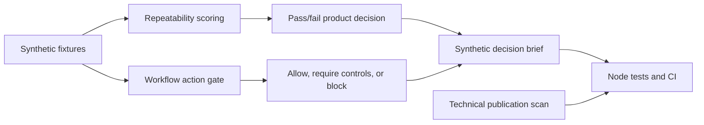

# Public Proof Pack

This page is the fastest way to review the public signal in this repository. It
is designed for hackathon organizers, AI platform credit programs and hiring
teams who need evidence without access to non-public project work.

## Quick Verification

```bash
npm run verify
```

The verification suite runs:

- Unit tests for repeatability scoring and workflow gating.
- Synthetic demos that print pass, fail and blocked decisions.
- A generated synthetic decision brief freshness check.
- A technical publication scan for token-shaped secrets, personal email
  exposure and optional private blocklist terms.

For local pre-publication checks, blocklist terms can be scanned without
committing them:

```bash
PUBLIC_SAFETY_BLOCKLIST_FILE=.public-safety-blocklist npm run public:scan
```

The `.public-safety-blocklist` file is intentionally ignored by Git.

Expected verification shape:

```text
# tests ...
# pass ...
Scenario: stable_capture_quality
Decision: pass
Action: generate_unreviewed_legal_conclusion
Decision: block
Synthetic decision brief is up to date.
Public safety scan passed
```

## Architecture Sketch



## What To Inspect

| Signal | Where | What it shows |
| --- | --- | --- |
| Repeatability harness | `src/eval/repeatability-score.js` and `test/repeatability-score.test.js` | Model-adjacent product output can be evaluated with explicit thresholds. |
| Workflow gate | `src/eval/workflow-gate.js` and `test/workflow-gate.test.js` | Automation needs confirmation, auditability, reversibility and review boundaries. |
| Decision brief | `docs/generated/synthetic-decision-brief.md` | Synthetic product results can be summarized into a reviewer-friendly artifact. |
| Synthetic fixtures | `examples/` | Public evidence can be useful without using real user, patient, client or production data. |
| Case studies | `case-studies/` | Private product lessons can be translated into redacted product reasoning. |
| Safety boundary | `SAFETY_AND_SCOPE.md` | The repo defines publication boundaries and conceptual redaction rules. |

## Short Profile Summary

Guillaume builds AI-assisted product workflows in constrained domains where
trust, privacy, uncertainty and failure states matter. This public repository
shows a compact synthetic evaluation workflow, workflow safety thinking and
small runnable harnesses without exposing private product code, production
prompts or sensitive datasets.

## Useful Links

- Public lab: https://github.com/guillaumevele/ai-product-lab
- GitHub profile: https://github.com/guillaumevele
- Website: https://www.guillaumevele.fr

## Redaction Boundary

This repository intentionally excludes:

- Private pre-release product source code.
- Real user, patient or client data.
- Patient imagery or biometric data.
- Production prompts, private evaluation datasets or internal model routing.
- Secrets, API keys, infrastructure details or deployment credentials.

The public claim is narrow: the repository demonstrates a synthetic evaluation
method, publication discipline and practical prototyping. It does not claim
clinical or legal authority.
